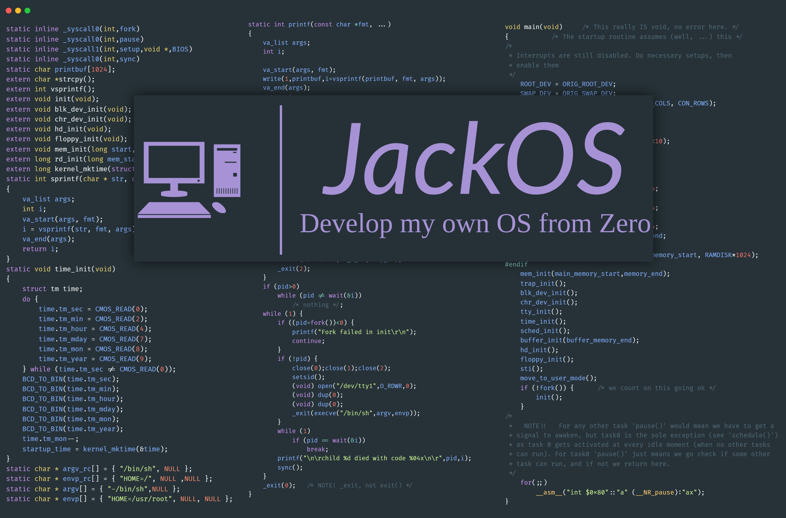
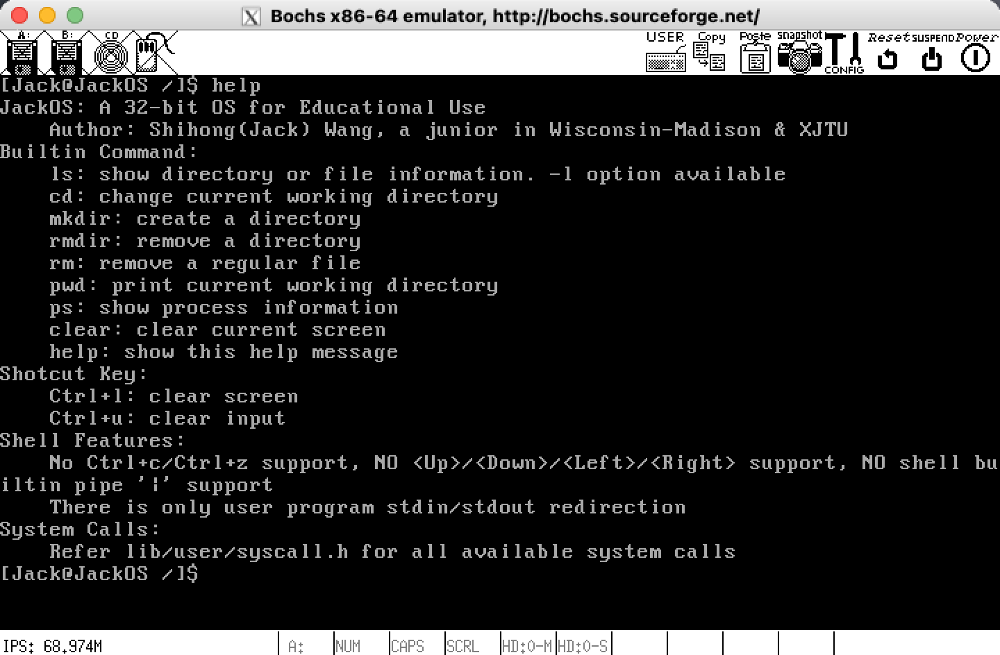
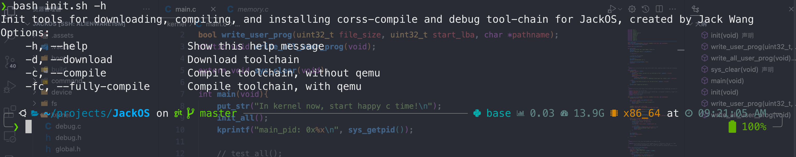
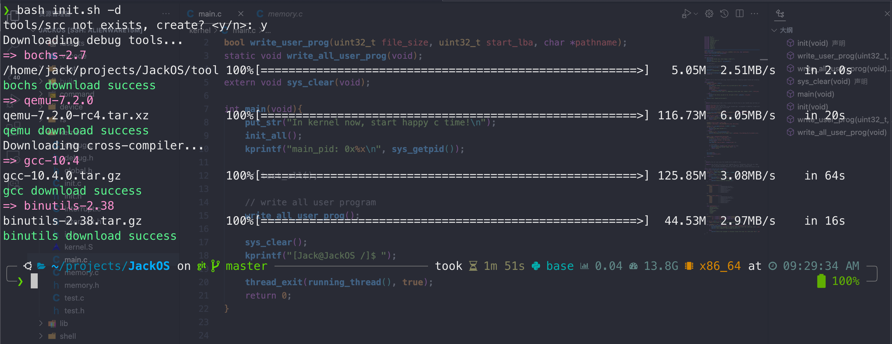
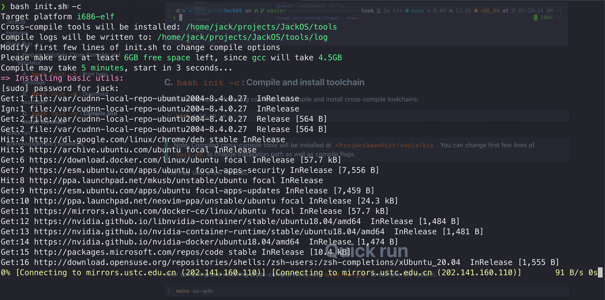
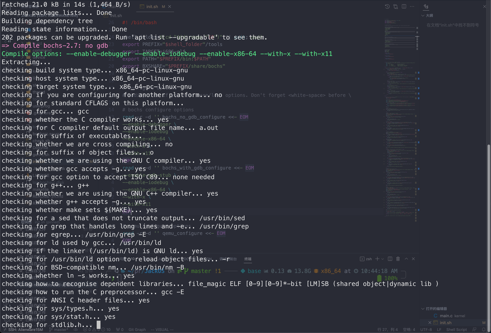
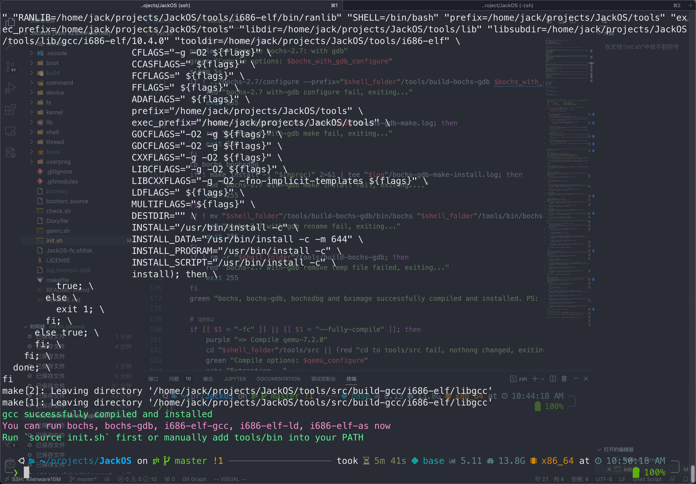
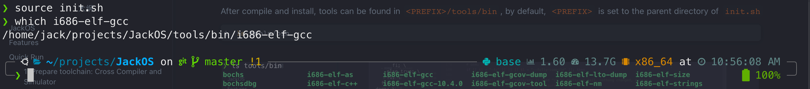

# JackOS

> JackOS: A simple operating system written by Shihong(Jack) Wang, for study and practice OS only.


**JackOS is a simple OS kernel that explains how a real Operating System runs.** It's so simple, that less that 7000 line of codes, but have all component that a real kernel has. By learning and hacking JackOS, you will get deeper understanding of JackOS.


I'm a junor student majoring in Computer Science, and JackOS is written when I take CS537 in UW-Madison for I think original projects are easy and want to challenge myself. And I succeed :).


I hope this repository can also help **those who want to learn more**, **those who are NOT satisfied with just concept** of Operating System, **those who want to read, write real Operating System Code**.


Reading a real OS source code like Linux is tooooo hard, because `slab` and `vfs` and other powerful components greatly increase its complexity, making it toooooo hard to understand. **The design approach of `JackOS` is the simple, the best**, so it implement any component in the simplest way, in order to make reader understand.




# Features

JackOS has following features:

- run under 32-bit Protect Modes, with secondary page table
- console works in text mode
- round-robbin scheduler
- has a ext2-like file system
- 32-bit ELF executable user program support

Demo Vides: 

- Youtube: https://www.youtube.com/watch?v=hB6vcdnRUc0
- Bilibili: https://www.bilibili.com/video/BV1Kv4y1X7Uk/?spm_id_from=333.999.0.0&vd_source=a46a785ab89c09f0998d1f3ad010a333


# Quick Run


### 1. Prepare toolchain: Cross Compiler and Simulator

I write a tool for initializing toolchains of JackOS by one-click: `init.sh`.

#### A. `bash init.sh -h`: Print help message

`init.sh` is a simple command line tool and easy to use.

Run

```bash
bash init.sh -h
```

and you will see:




#### B. `bash init.sh -d`: Download toolchain

Run following command, toolchain will download cross-compile toolchains for you. 

```sh
bash init.sh -d
```
> Note: by default, cross-compile toolchain source code will be download at `<ProjectBaseDir>/tools/src`. You can change first few lines of `init.sh` to change installation path.





#### C. `bash init.sh -c`: Compile and install toolchain


After download, run following command to compile and install cross-compile toolchains:

```sh
bash init.sh -c
```


> Note: Compiled cross-compile tools will be installed at `<ProjectBaseDir>/tools/bin`. You can change first few lines of `init.sh` to change installation path as well as compile flags.

This may take a few minutes. 








#### D. `source init.sh`: install in PATH

After compile and install, tools can be found in `<PREFIX>/tools/bin`, by default, `<PREFIX>` is set to the parent directory of `init.sh`

```sh
ls tools/bin
```


Run `init.sh`, so that add `<PREFIX>/tools/bin` into `PATH`

```sh
source init.sh
which i686-elf-gcc
```




### 2. Run JackOS

#### A. One step method: `make run-no-gdb`

After compiling and installing cross-compile tools, run `make run-no-gdb` to compile the kernel and start bochs.

```shell
make run-no-gdb
```


#### B. Two step method: `make no-gdb` and `bochs -f bochs`

Besides `make run-no-gdb`, first running `make no-gdb` and then `bochs -f bochs` are exactly the same .

```sh
make no-gdb
bochs -f bochsrc
```


# Reference

**Resources (blog / video / paper / book, etc.) and people listed below help a lot to this project. Thanks to their time, energy and selfless dedication of sharing their knowledge.**

Here's the reference list:


**Manual/Reference**:

- [Intel 64 and IA-32 Architecture Software Developer's Manual (Full Volume Bundle)](https://www.intel.com/content/www/us/en/developer/articles/technical/intel-sdm.html)
- IBM PC/AT Technical Reference
- IBM VGA/XGA Technical Reference
- Serial ATA - Advanced Host Controller Interface (AHCI), Revision 1.3.1
- Serial ATA: High Speed Serialized AT Attachment, Revision 3.2
- ATA/ATAPI Command Set - 3 (ACS-3)


Books:

- *Operating Systems: Three Easy Pieces* (Remzi, A & Andrea A.)
- *Computer System - A Programmer's Perspective Third Edition (CS:APP)* (Bryant, R & O'Hallaron, D)
- *Modern Operating System* (Tanenbaum, A)
- *X86/x64 Architecture: Exploration and Programming* (Zhi, D)
- *Operating System: Truth Restoration* (Gang, Z)
- *Professional Linux Kernel Architecture* (Wolfgang, M)
- *A Heavily Commented Linux Kernel Source Code Linux Version 0.11*, (Jiong, Z)


Websites:

- [OSDev](https://wiki.osdev.org/Main_Page) - Some ancient resources。
- [FreeVGA](http://www.osdever.net/FreeVGA/home.htm) - Resources about VGA programming。


Other: 

- Linux Manual


# Acknowledgement

This repository is finished when I participate VISP (Visiting International Student Program) in UW-Madision. 


In detail, I took CS537: Operating System. This course taught me the basic knowledge of the operating system and inspired me to write the operating system.


Thanks for TAs teams when I ask some detailed api problem. Thanks professor Remzi for giving visionary suggestions at every important moment or JackOS won't be finished within the semester.
